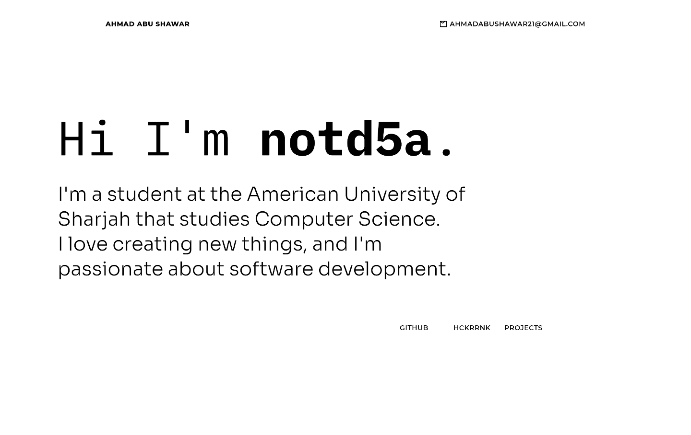

### Frameworks
```sh
$ add --framework "Vaadin" --language "Java" --project "Crypt"
$ add --framework "Reflex" --language "Python" --project "DeScam"
$ add --framework "SDL" --language "C" --project "Codename CGOL"
```

### Things i want to learn
- Operating Systems Development
- Machine Learning and AI
- Network Programming
- IOT
- Cyber Security

## Passions
- All manner of things related to Cars and Driving them :)
- Application of Machine Learning and AI Techniques in Cybersecurity
- Software development
- Systems Level Programming
- Distributed Systems

## Skills
For this account and my old [account](https://github.com/notd5a) of which i got locked out of :)
- Java
- Go
- HTML
- CSS
- Python
- C / C++

## How to contact me:
My [Email](ahmadabushawar21@gmail.com)
