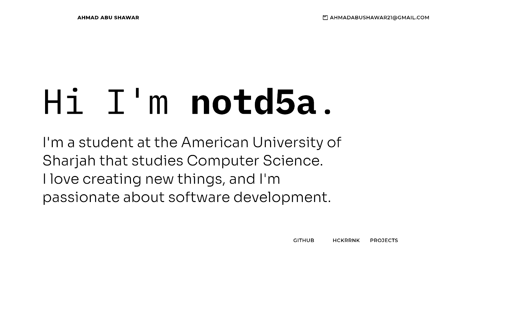

# Personal Details
My name is Ahmad Abu Shawar. You can contact me @ ![ahmadabushawar21@gmail.com]. I am currently residing in the UAE.

#  Projects

## Skills
### Programming languages
- Java
- Go
- Dart
- Python
- C /C++

### Frameworks, top being i know them really well and bottom meaning i dabbled in it
- `$ add --framwork "Vaadin" --language "Java" --project "Codename Crypt"`
- `$ add --framwork "Flutter" --language "Dart" --project "Codename Savior"`
- `$ add --framework "SDL" --language "C" --project "Codename CGOL"`

### Things im hoping to learn
- Rust
- 

## Passions
- All manner of things related to Cars and Driving them :)
- Software development, programming

## How to contact me:

